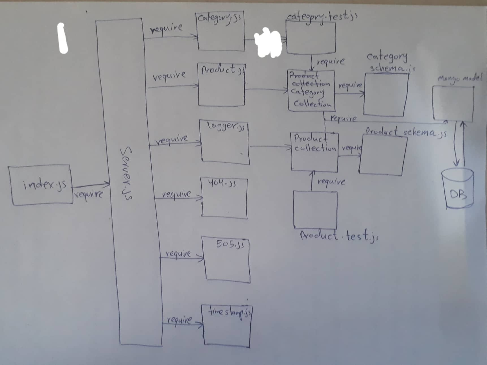

# Business Requirements
Refer to the [API Overview](https://codefellows.github.io/code-401-javascript-guide/curriculum/apps-and-libraries/api-server/) for a complete review of the application, including Business and Technical requirements along with the development roadmap.

## Phase 1 Requirements
For the first phase, our API will perform CRUD operations using ReST methods on 2 data models using json-server, an installable and configurable API application used to “spin up” servers for testing purposes. We will be using this to set the goal for our business requirements, and create working documentation.

Each of the following user stories are to be executed for both categories and products data models

As a developer, I want to CREATE a new record in a database, using the POST method on a custom API
As a developer, I want the API to return the record I create in JSON format
As a developer, I want to GET list of all records in a database, using the GET method on a custom API
As a developer, I want the API to return an object containing count, and a results[] array
As a developer, I want to GET an existing in a database, using the GET method with an ID parameter on a custom API
As a developer, I want the API to return an object containing the record from the database
As a developer, I want to UPDATE an existing record in a database, using the PUT and PATCH methods with an ID parameter on a custom API
As a developer, I want the API to return the record I updated in JSON format
As a developer, I want to DELETE an existing record in a database, using the DELETE method with an ID parameter on a custom API
As a developer, I want the API to return the record I updated in JSON format
As a developer, I want Swagger documentation for this API so that I can make it easier for other developers to use and understand.

## Phase 2 Requirements
From a business requirements standpoint, nothing changes. json-server did a great job of serving as a “mock” API server for our application. In this phase ,we begin the transition towards making a “real” API server. Specifically, we will be replicating the same functionality json-server provided by writing our own server, using Express and Node.js

## Phase 3 Requirements
From a business requirements standpoint, nothing changes. In this phase, we continue the transition towards making a “real” API server. Specifically, we will be migrating from in-memory data storage to using Mongo to store our data permanently, and modularizing our routes for flexibility. Through it all, we will be providing the same interface to our users. To the outside world, our API remains unchanged.
### Pahse 3 UML

## Phase 4 Requirements
From a business requirements standpoint, once again, nothing changes. Our API must continue to work as advertised on day 1. The focus of this phase is purely on refactoring. That means we’ll be targeting creating elegant, highly performant code that scales well and is extensible.

Specifically, from the API side, we will be combining our router modules into a single module that can load the correct model dynamically. On the data model side, we’ll be DRYing up the collection module for our 2 data models into a common “mongo” collection so that adding new data models in the future is as easy as adding a schema file

### Pahse 4 UML

### Pahse 4 API documentaion
[API documentaion File](https://github.com/alhrthani-401-advanced-javascript/api-server/doc/hertani86-class-09-0.1-swagger.json)